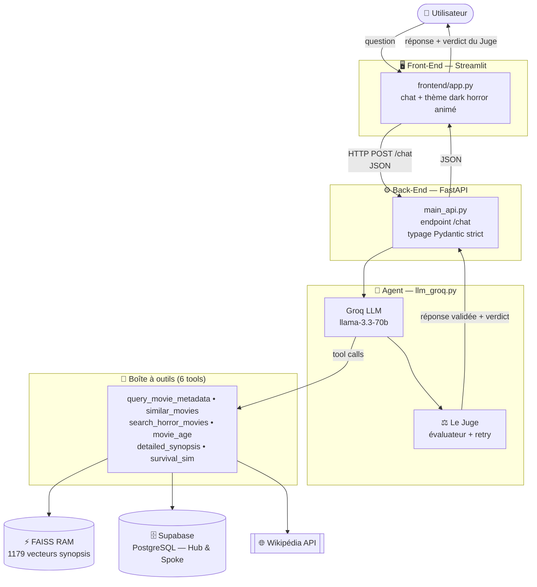
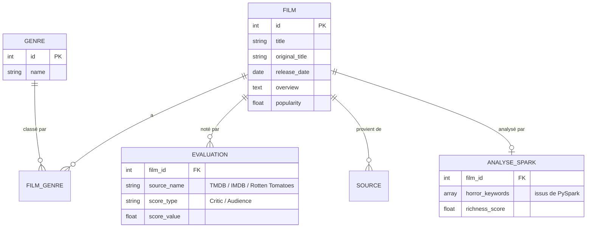
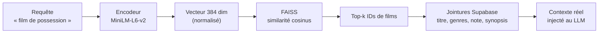
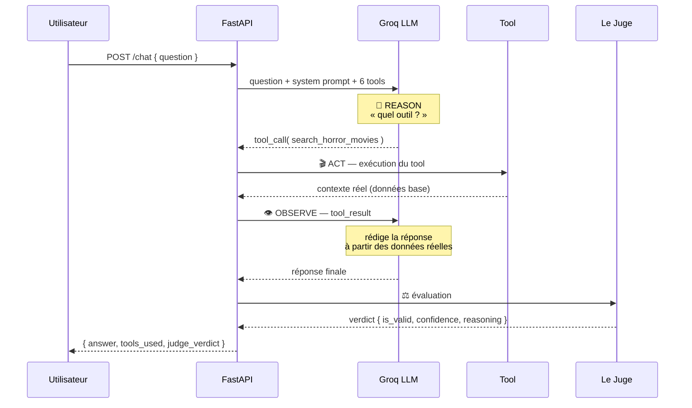
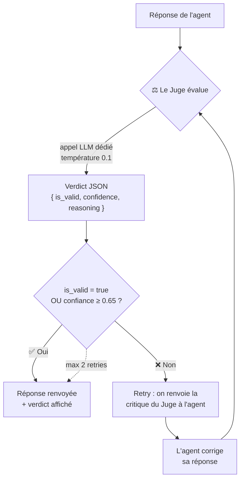

# 🩸 HorRAGor BOT — Dossier de présentation

> Agent conversationnel spécialisé dans l'univers de l'horreur
> (cinéma, littérature, jeux vidéo)
> **Partie 2 — Le « cerveau » de l'application (Agentic AI / ReAct)**

---

## 1. Contexte & objectif

Après la **Partie 1** (industrialisation de l'ingestion et de la réconciliation
des données de films d'horreur — pipeline MDM + PySpark), la **Partie 2** consiste
à construire l'**agent conversationnel** qui exploite ce savoir.

L'objectif : un agent capable de **raisonner**, d'**interroger intelligemment**
sa base structurée (SQL) et vectorielle (FAISS), et — si besoin — d'aller chercher
de l'information « en direct » sur le web, **sans halluciner**.

Le fil rouge de tout le projet : **fiabilité des réponses**. C'est pourquoi
chaque réponse est relue par un second agent, **Le Juge**.

---

## 2. Architecture globale



**Principe de découplage strict** : le front ne contient **aucune logique métier**.
Il capture la question, l'envoie en HTTP à l'API, et affiche le JSON reçu.
Toutes les clés (Groq, Supabase) et tous les accès base sont **confinés au back-end**.

---

## 3. Stack technique & justification des choix

| Composant | Techno choisie | Pourquoi ce choix |
|---|---|---|
| **LLM** | Groq — `llama-3.3-70b-versatile` | Inférence **ultra-rapide** (Groq LPU), modèle open-weight puissant, **gratuit**, compatible avec le SDK OpenAI (donc `tool-use` standard) |
| **Back-End** | FastAPI + Uvicorn (async) | API REST **asynchrone**, typage natif Pydantic, doc Swagger auto (`/docs`) |
| **Front-End** | Streamlit | Chat natif (`st.chat_input`/`st.chat_message`), prototypage rapide, thème personnalisable |
| **Embeddings** | `sentence-transformers/all-MiniLM-L6-v2` | Léger (~91 Mo), rapide, multilingue, bon rapport qualité/taille pour la similarité de synopsis |
| **Mémoire vectorielle** | FAISS (index en RAM) | Recherche par similarité **instantanée** sans surcharger la base principale |
| **Base de données** | Supabase (PostgreSQL) via `psycopg2` | Hérité de la Partie 1 ; requêtes SQL **paramétrées** (sécurité) |
| **Gestion des dépendances** | `uv` | Résolution ultra-rapide, `uv sync` reproductible |

### Choix d'architecture assumés (à défendre en soutenance)

- **FAISS local plutôt que pgvector** : le brief suggérait pgvector (extension
  Supabase) pour la similarité. Nous avons préféré un **index FAISS en RAM** :
  latence quasi nulle, aucune charge sur la base, et découplage total du calcul
  vectoriel. Trade-off : l'index doit être reconstruit si les données changent
  (`utils/build_faiss_index.py`).

- **Boucle ReAct « maison » plutôt que LangGraph** : nous avons implémenté le
  cycle *Reason → Act → Observe → Respond* directement via le `tool-use` du SDK.
  Cela réduit les dépendances, rend le flux **transparent et débogable**, et nous
  a permis de brancher facilement notre nœud d'évaluation (Le Juge).

---

## 4. La base de connaissances — architecture Hub & Spoke

Héritée de la Partie 1, la base suit un modèle **Hub & Spoke** (moyeu & rayons) :
une entité centrale `film` autour de laquelle gravitent les tables satellites.



**Conséquence pratique** : les genres et les notes **ne sont pas des colonnes de
`film`**. Il faut des jointures (`film_genre`+`genre` pour les genres,
`evaluation` pour les notes). C'est central pour comprendre le code des tools.

> 💡 *Anecdote de dev réelle* : un bug est apparu car une requête interrogeait
> une colonne `genres` directement sur `film` (inexistante). Le message d'erreur
> déguisait ça en « base inaccessible ». La correction : refaire les jointures
> Hub & Spoke — exactement ce que faisaient déjà les autres tools.

---

## 5. La mémoire éphémère : FAISS

**Rôle** : retrouver des films par **sens** (sémantique), pas par mots-clés exacts.

**Comment ça marche** :



- À la construction, chaque **synopsis** des 1179 films est transformé en vecteur.
- L'index stocke le couple `[vecteur → ID film]` (`data/faiss.index` + `id_map.npy`).
- Les vecteurs sont **normalisés** → le produit scalaire = **similarité cosinus**.
- L'index est **pré-chargé au démarrage** de l'API (lifespan FastAPI) et partagé
  en singleton pour ne charger le modèle **qu'une seule fois** en mémoire.

---

## 6. L'agent ReAct & le tool-use

L'agent suit le paradigme **ReAct (Reason + Act)** : le LLM **raisonne** sur la
question, **décide** quel outil appeler, **observe** le résultat, puis **rédige**
la réponse finale.



**Sécurité** : le LLM **ne génère jamais de SQL brut**. Chaque outil est une
fonction Python avec des **requêtes paramétrées** — le LLM ne fait que fournir un
titre de film ou une requête textuelle.

---

## 7. La boîte à outils — les 6 tools

| # | Nom (tool) | Rôle | Technique |
|---|---|---|---|
| 1 | `query_movie_metadata` | Infos d'un film précis | SQL + jointures `genre` & `evaluation` (TMDB/IMDB/RT) |
| 2 | `similar_movies` | Films similaires à un titre | FAISS sur le synopsis du film de référence |
| 3 | `search_horror_movies` | Recherche libre / recommandation | FAISS sur la requête utilisateur |
| 4 | `movie_age` | Âge exact d'un film | Python pur (calcul de date, mois en français) |
| 5 | `detailed_synopsis` | Détails, anecdotes, tournage | API Wikipédia + BeautifulSoup |
| 6 | `survival_sim` | Simulateur de survie (ludique) | Synopsis + mots-clés PySpark + prompt créatif |

**Détails notables :**

- **Tool 2 (similaires)** : encode le synopsis du film demandé, cherche `k+1`
  voisins puis **exclut le film source** lui-même, et préserve l'**ordre de
  similarité** FAISS lors de la récupération SQL.
- **Tool 4 (âge)** : **aucun appel LLM ni réseau** — fonction Python pure. Un
  dictionnaire `_MOIS_FR` évite de dépendre de la locale système (bug Windows
  anglais corrigé).
- **Tool 5 (Wikipédia)** : utilise l'**API REST** de Wikipédia (pas de scraping
  HTML fragile), nettoie les sections inutiles (Références, Liens externes) et
  **tronque proprement** à la dernière phrase complète (max 2000 caractères).
- **Tool 6 (survie)** : réexploite les `horror_keywords` produits par **PySpark
  en Partie 1** + un prompt qui transforme le LLM en « maître du jeu sadique »,
  avec un format de rapport imposé (probabilité de survie, causes de mort, etc.).

---

## 8. ⚖️ Le Juge — anti-hallucination

C'est la **pièce maîtresse** du projet côté fiabilité. Après chaque réponse, un
**second appel LLM** joue le rôle d'évaluateur critique.

### Fonctionnement



- **Prompt strict** : le Juge doit répondre **uniquement** en JSON :
  `{"is_valid": true, "confidence": 0.95, "reasoning": "..."}`.
- **Température basse (0.1)** : on veut un jugement **déterministe et sévère**,
  pas créatif.
- **Critères de rejet** : hallucination détectée, réponse hors-sujet, données
  contredites, réponse vide ou incompréhensible.
- **Boucle de correction** : si `is_valid = false` **et** confiance < 0.65,
  la critique est réinjectée à l'agent qui **corrige** sa réponse.
  Jusqu'à **2 tentatives** (`_MAX_RETRIES`).

### Affichage temps réel dans l'UI

Le verdict apparaît dans un **bandeau en bas** de l'interface :

| Icône | Verdict | Condition |
|---|---|---|
| 🩸 | LE JUGE A APPROUVÉ | valide **et** confiance ≥ 80 % |
| ⚠️ | LE JUGE EST MITIGÉ | valide **et** confiance < 80 % |
| 💀 | LE JUGE CONDAMNE | non valide |

Le bandeau affiche aussi les **outils utilisés** (`⚙ search_horror_movies`).
Les noms d'outils **n'apparaissent jamais** dans le corps de la réponse — ils sont
réservés au bandeau pour garder les messages naturels.

---

## 9. Le Front-End — expérience immersive

### Conformité au brief
- **Composants natifs** : `st.chat_input` + `st.chat_message` (bulles + historique).
- **Loader** : `st.spinner("HorRAGor réfléchit…")` pendant l'appel API.
- **Découplage strict** : uniquement `httpx.post()` vers l'API, zéro logique métier.
- **Thème imposé** via `.streamlit/config.toml` (versionné sur Git).

### La touche « dark horror » (au-delà du brief)
Arrière-plan animé injecté en **JS/SVG** (canvas + overlay) : lune, château,
brouillard, chauves-souris et **zombies interactifs** :

- **Drag & throw** — on attrape un zombie à la souris et on le lance (physique de
  gravité, retombée en arc jusqu'au sol).
- **Plateformes** — un zombie lancé peut marcher sur les **nuages** (dérivants),
  les **créneaux du château**, ou **en orbite autour de la lune** (y compris tête
  en bas).
- Les zombies passent **au premier plan** (z-index), devant le bandeau et le
  verdict, sans jamais bloquer la saisie.

> Objectif : montrer qu'une UI de data-projet peut être **soignée et mémorable**.

---

## 10. Contrat d'API (typage Pydantic strict)

**Entrée** — `ChatRequest` :
```json
{ "question": "Parle-moi de The Shining", "user_id": null, "conversation_id": null }
```

**Sortie** — `ChatResponse` :
```json
{
  "answer": "🎬 The Shining — 1980 ...",
  "tools_used": ["query_movie_metadata", "groq-llm"],
  "judge_verdict": { "is_valid": true, "confidence": 0.95, "reasoning": "..." },
  "conversation_id": "conv_anonymous"
}
```

Endpoints : `POST /chat` · `GET /health` · `GET /info` · doc Swagger `/docs`.

---

## 11. Pistes de démo (fil conducteur pour la présentation)

| Question à taper en live | Outil déclenché | Ce que ça montre |
|---|---|---|
| « Parle-moi de The Shining » | `query_movie_metadata` | Données **réelles** de la base (pas d'hallucination) |
| « Recommande un film de possession » | `search_horror_movies` | Recherche **sémantique** FAISS |
| « Films similaires à Hereditary » | `similar_movies` | Similarité vectorielle |
| « Quel âge a Halloween ? » | `movie_age` | Outil **Python pur**, calcul exact |
| « Donne-moi des anecdotes sur Alien » | `detailed_synopsis` | Enrichissement **web live** (Wikipédia) |
| « Je survivrais dans Scream ? » | `survival_sim` | Créativité + données PySpark |

À chaque réponse : **montrer le bandeau du Juge** (verdict + confiance + outils).

---

## 12. Limites & perspectives

- **Mémoire conversationnelle** non implémentée (chaque question est indépendante)
  → piste : historique multi-tours.
- **pgvector** non utilisé (choix FAISS assumé) → piste : migration si passage à
  l'échelle avec données évolutives.
- **Orchestration Prefect** (option du brief, côté pipeline Partie 1) non couverte.
- Supabase Free Tier se **met en pause** après 7 jours d'inactivité → penser à un
  keep-alive pour une démo.

---

## 13. En une phrase

> **HorRAGor BOT** est un agent **ReAct** qui répond sur l'horreur en s'appuyant
> sur des **données réelles** (SQL + vectoriel + web), le tout **contrôlé par un
> Juge anti-hallucination**, dans une interface **immersive et découplée**.

---

*Équipe : Tim (Front-End Streamlit) · Nicolas (FAISS + similarité) · Julie (API FastAPI + Tools)*
